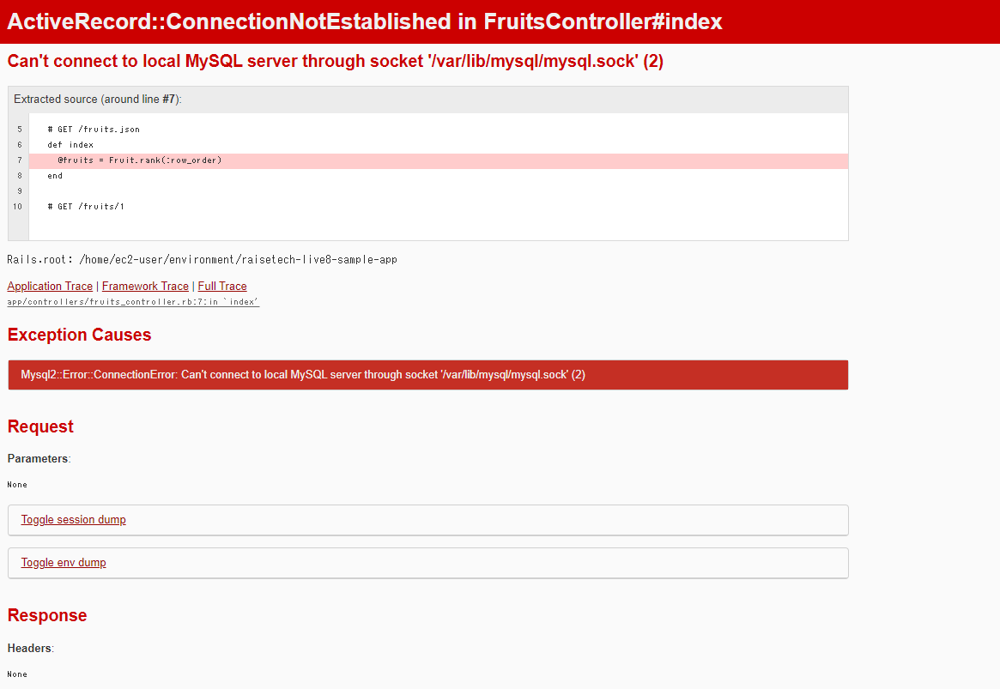

# 第三回課題
* **APサーバー**について  
  * APサーバーの名前　**PUMA**　version **5.6.5**  

  * APサーバーを終了させる方法　**Ctrl+C**　　

  * APサーバーの再起動命令 **rails s**

* **DBサーバー**について
  * DBサーバーの名前 **MySQL** version **8.0.35**
  * DBサーバー停止命令 **sudo service mysqld stop**
  * DBサーバー起動命令 **sudo service mysqld start**
  * DBサーバー状態確認 **sudo service mysqld status** 

* Rails構成管理ツール**bundler**

# 感想
- 一つ一つのコメントや単語の意味を調べながら、課題を実施したのでものすごく時間がかかった。  